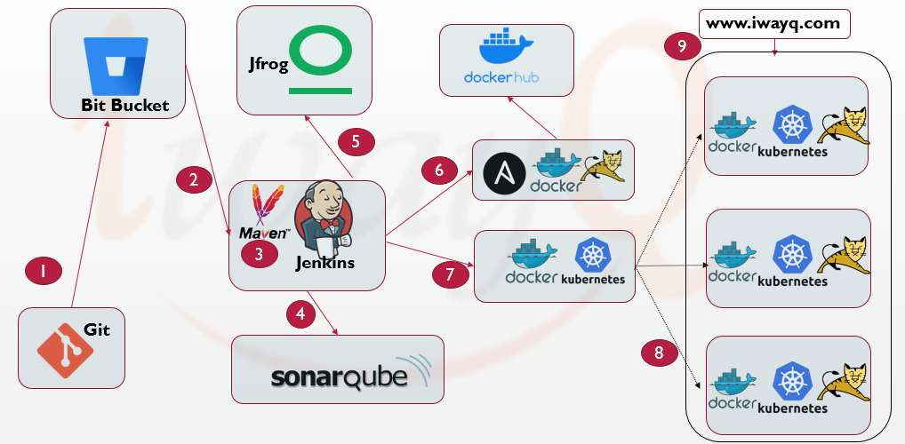

# What is DevOps?
DevOps is the set of practices that collaborate with Developers and IT Operation Roles. i.e DevOps is not a Tool, it is the process or culture that the engineer has to follow certain procedures that establish collaboration between Developers and IT Operational Engineer to fasten the application delivery in a fully automated fashion.  

# DevOps Goal

DevOps primarily works based on below three principles to fasten the application deployments with Continuous Feedback and Continuous Deployments automatically.

- Communication
- Collaboration and
- Integration

# DevOps Tools

In the DevOps world there are hundreds to thousand tools which can be integrated together to have automated application deployments.

DevOps tools that are required to be integrated vary based on the business requirements and application programming used for the build process.

Below Diagram depicts some of the DevOps tools that are frequently used for Java application integration and deployments.

This DevOps Project covers high level steps to configure and integrate below tools for automated application deployments.    

- Git
- Github
- Apache Maven
- Jenkins
- SonarQube
- Artifactory
- Docker
- Ansible
- Apache Tomcat
- Kubernetes

Concepts used to automate application deployments using Jenkins CI/CD:

- Source Code Management
- Jenkins Pipeline - CI/CD
- Build Source Code
- Code Quality Analysis
- Artifact Management
- Continuous Delivery
- Continuous Deployments
